# AI微专业专业综合设计报告

* [1 课题意义](#1-课题意义)
* [2 研究背景](#2-研究背景)
* [3 理论部分](#3-理论部分)
   * [3.1 图像分割简介](#31-图像分割简介)
   * [3.2 PaddleSeg简介](#32-paddleseg简介)
   * [3.3 车道线检测Baseline简介](#33-车道线检测baseline简介)
* [4 主要研究工作](#4-主要研究工作)
   * [4.1 Baseline环境搭建](#41-baseline环境搭建)
   * [4.2 数据处理](#42-数据处理)
      * [4.2.1 数据扩充](#421-数据扩充)
      * [4.2.2 数据均衡](#422-数据均衡)
   * [4.3 模型融合](#43-模型融合)
* [5 仿真结果](#5-仿真结果)
   * [5.1 数据集](#51-数据集)
   * [5.2 性能指标](#52-性能指标)
   * [5.3 仿真展示](#53-仿真展示)
* [6 结果和讨论](#6-结果和讨论)
* [7 参考文献](#7-参考文献)

------

## 1 课题意义

全国大学生智能汽车竞赛是以智能汽车为研究对象的创意性科技竞赛，是面向全国大学生的一种具有探索性工程的实践活动，是教育部倡导的大学生A类科技竞赛之一。竞赛以立足培养，重在参与，鼓励探索，追求卓越为指导思想，培养大学生的创意性科技竞赛能力。

作为“新一代人工智能地图”的百度地图，秉承着“用科技让出行更简单”的使命，借助于图像识别、语音识别、大数据处理等人工智能技术，大幅提升地图数据采集和处理的自动化程度，实现道路覆盖超过1000万公里，已成为业内AI化水平最高、搭载的AI技术最强最丰富的地图数据厂商。在地图数据中，精确检测车道线及类型对无人/辅助驾驶、保障出行用户的安全，具有至关重要的作用。本次赛题要求基于高精度俯视图数据，设计一个车道线检测和分类模型。

本次竞赛的题目和数据由百度地图数据引擎部提供，模型和基线相关技术支持由深度学习技术平台部和视觉技术部提供，一站式AI开发平台AI Studio由百度AI技术生态部提供。要求参赛者利用提供的训练数据，设计一个车道线检测的深度学习模型，来检测测试数据中车道线的具体位置和类别，不限制深度学习任务。 样例示范如图1.1所示：

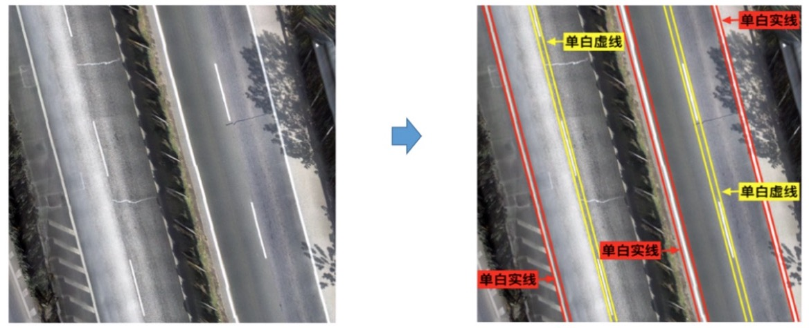
> 图1.1 车道线检测任务示意图

而人工智能AI微专业综合设计课程是微专业教学阶段总结性的实践教学环节，通过该环节，使学生能够综合运用人工智能专业领域知识解决实际工程问题；理解人工智能实践应承担的社会发展、人类健康、国家及公民安全、国家法律及地方法规、文化建设责任；能够通过自主学习提高分析问题和解决问题的能力；具备解决人工智能专业相关技术问题的基本能力；具备归纳总结研究成果的能力；能够撰写报告和设计文稿，清晰表达研究和设计的方案及结果，并回答相关技术问题；具备运用现代信息技术工具进行自主学习的能力；实现综合能力提升，为个人发展奠定基础。

因此本科综合课程设计使用源于产业实践的开源深度学习平台——百度飞桨PaddlePaddle，基于高精度俯视图的训练数据，设计一个车道线检测的深度学习模型，来检测测试数据中车道线的具体位置和类别，不限制深度学习任务。

## 2 研究背景

车道线检测是自动驾驶任务的基础和重要组成模块，良好的车道线检测算法对于无人车的自动驾驶具有重要意义。该任务已经有相当长时间的研究，早期主要使用计算机视觉（Computer Vision，简称CV）和数字图像处理（Digital Image Processing，简称DIP）领域的相关算法进行图像处理进而检测车道线。随着深度学习和人工智能的发展，AI技术已经在越来越多的领域发挥重要作用，而深度学习在车道线检测上的应用无疑是其又一次成功的融合。随着深度学习的加持，车道线检测任务所应对的场景越来越多样化，逐步已经脱离了对于“白、黄色线条”这种低阶理解，已经转向寻求对于语义上车道线存在的位置，即使它是模糊的、被光照影响的、甚至是完全被遮挡的。

常用的车道线检测数据集如表2.1所示：

> 表2.1

基于深度学习的车道线检测算法目前主要集中像素级（pixel wise）方法。Up-Convolutional Networks[1]参考FCN，在特征提取阶段使用VGG16作为基础，降低网络中的4096个7\*7的滤波器为1024个3\*3的滤波器，大大降低网络参数，使计算速度有着显著的提升；同时融合U-Net的思想，增加了网络放大层的宽度，使得精度也得到一定程度的增加，其核心网络结构如图2.1所示。

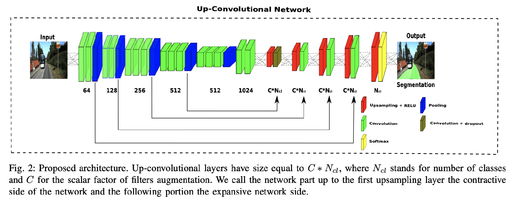
> 图2.1 Up-Convolutional Networks 网络结构示意图

RBNet（Road and road Boundary detection Network）[2]用于在图像上精确检测道路及其边界，引入深度神经网络，首先研究道路之间的语义关系结构和边界排列，再通过贝叶斯模型，实现在一个过程中同时检测道路和边界。其核心网络结构如图2.2所示。

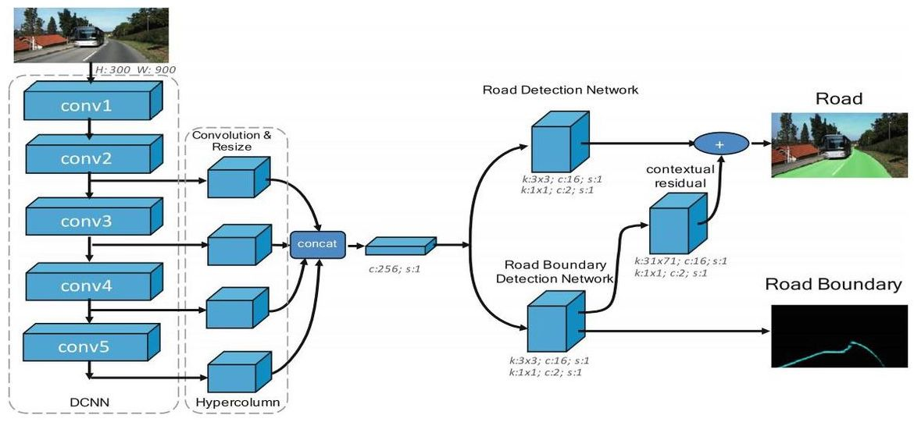
> 图2.2 RBNet 网络结构示意图

尽管卷积神经网络（Convolutional Neural Network，CNN）从原始图像中提取语义信息方便又很强的能力，但现有CNN网络架构无法充分融合图像在行和列上的空间关系。但这些关系对于强先验对象的学习具有重要的作用，尤其是在外观的连贯性难以达到很高的能力。例如在车道线检测问题上，经常容易受遮挡的影响或是路面上原本就不存在车道线。在Spatial CNN[3]中，将传统卷积层层接层（layer-by-layer）的连接方式转为特征图（feature map）中片连片（slice-by-slice）卷积的形式，使得图像中行和列间可以更好的传递信息，因此可以更好的寻找空间关系强但外观线索交叉的目标，在道路问题中尤其适用于检测长距离连续形状的目标 —— 车道线。SCNN方法在TuSimple中获得第一名，准确率达到96.53%。其核心网络结构如图2.3所示。

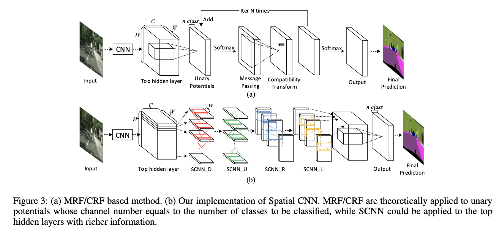
> 图2.3 SCNN 网络结构示意图

Davy Neven等人[4]提出端到端的车道线检测方法，通过像素分割训练，由于接受域非常大，在图像中即使没有标记的情况下也能很好的进行指导。将每个车道形成自我实例，因此可以做到端到端的训练，同时为了在你和车道前对车道实例进行参数化处理，进一步提出基于图像学习的视角变换，而不仅仅固定在“鸟瞰图”变换，如此使得车道线拟合对道路平面的变换是健壮的，在测试中运行速度可以达到50fps，且可以处理可变车道数和车道变换。核心网络架构如图2.4所示。

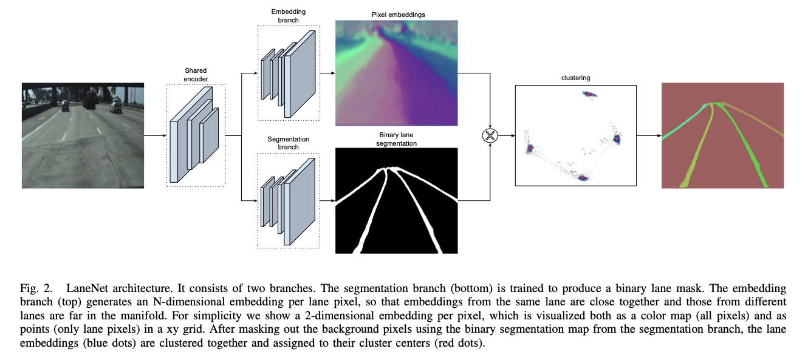
> 图2.4 端到端的车道线检测网络结构示意图

也有一些方法在图像基础上融合了激光雷达传感器，直接在3D空间产生非常精确的拟合，如Min Bai等人提出的Deep Multi-Sensor Lane Detection[5]，在高速公路和城市路况的复杂场景中展现了精确的估计，并能很好的解决交通阻塞、分叉、合并和交叉。3D CNN网络也被引入车道线检测任务，3D-LaneNet[6]无需假定已知的恒定车道宽度或依赖预映射的环境，通过内部网反透视映射(IPM)和基于锚点的通道表示，以显式地方式处理复杂的情况，如lane合并和分割，其网络架构如图2.5所示。

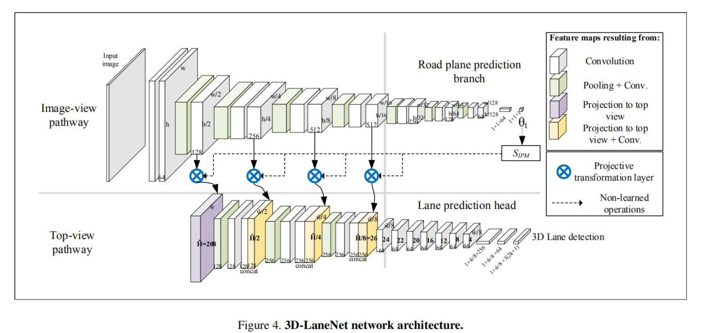
> 图2.5 3D-LaneNet 网络结构示意图

百度Apollo研究院在2020年3月提出了一种广义和可扩展的方法Gen-LaneNet[7]，仅需单一图像酒客检测三位车道，其在单一网络中解决了图像编码、特征空间变换和三位车道预测的统一模型。首先在新的坐标系中引入了一种新的几何导向的车道锚点表示，并应用特定的几何变换直接从网络输出中计算真实的三位车道点；另一方面将图像分割自网络的学习与几何编码子网络解耦，大大减少了在现实应用中实现健壮解决方法所需的3D-lane标签数量。此外，还提出了新的合成数据集及其构建策略，以促进三维车道检测方法的发展和评价。其网络架构如图2.6所示。

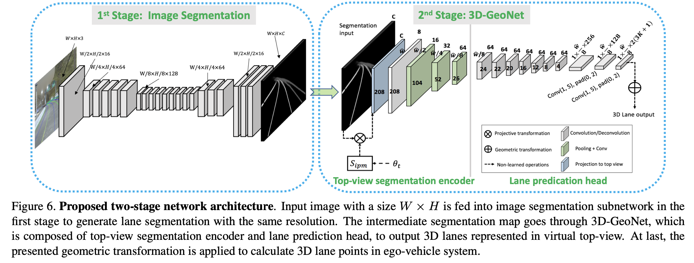
> 图2.6 Gen-LaneNet 网络结构示意图

## 3 理论部分

### 3.1 图像分割简介

图像分割（image segmentation）是图像语义理解的重要一环，指将图像分成若干具有相似特性区域的过程，从数学角度看，图像分割是将图像划分成互不相交区域的过程。近些年随着深度学习和神经网络技术的深入，图像分割技术有了很大程度的发展，相关技术已经应用在场景物分割、人体前景背景分割、三维重建等技术，在现实应用中，也在无人驾驶、增强现实、安防监控等领域有着极为广泛的应用。

图像分割主要有三种理论依据的方法：基于图论的分割方法、基于聚类的分割方法和基于语义的分割方法。

**A. 基于图论的分割方法**

基于图论的图像分割方法将图像映射为带权的无向图$G=(V,E)$，将像素视为节点集合$V = \{v_1,...,v_n\}$，其中$E$为边的集合。将图像分割问题转化为对图的顶点划分问题，并使用最小割（min-cut）[8]原则将图像进行最优分割。途中每个$N \in V$的节点都对应图像中的某个像素，每条边$e \in E$连接着一对相邻像素，有$(v_i,v_j) \in E$且边的权重为$w(v_i,v_j)$，其表示相邻像素在灰度、颜色或纹理方面的非负相似度。图像的一个分割$S$即相当于对图的一个剪切，每个被分割的区域$C \in S$都对应着图中的一个子图。

基于图论的分割方法满足的原则是使得划分后的子图在内部保持最大的相似度，而在子图之间保持最小的相似度。在两类分割实例中，对于两个子集$A,B$的图$G=(V,E)$进行划分满足公式3.1
$$
CUT(A,B)=\sum_{\mu \in A,v \in B}w(\mu,v)
$$
其中$A \cup B=V, \quad A \cap B=\phi$，$w(\mu,v)$就是使得该图满足最小分割的权重，如图3.1所示。

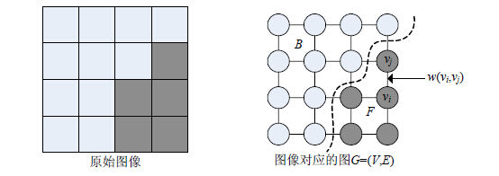
> 图3.1 两类分割实例的示意图

基于图论的图像聚类代表方法有NormalizedCut[9]，GraphCut[10]，GrabCut[11]等。

**B. 基于聚类的分割方法**

基于聚类的图像分割方法主要分为两个步骤：

（1）初始化聚类区域

（2）迭代的将像素、亮度、纹理等特征相似的死昂宿聚类道同一区域中，直至收敛，最终得到图像分割的结果。

一个基于聚类的分割方法示意图如图3.2所示。

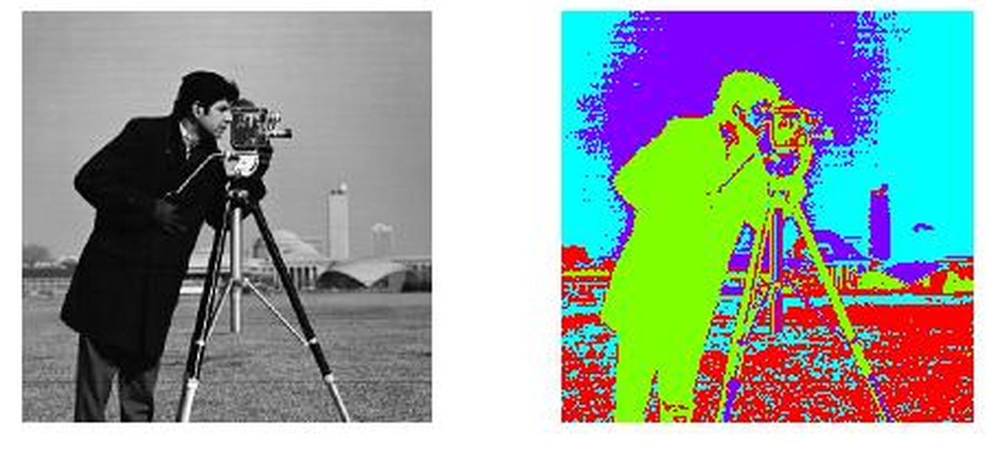
> 图3.2 基于聚类的分割方法示意图

基于聚类的图像聚类代表方法有K-means，谱聚类，Meanshift[12]和SLIC[13]等。聚类方法可以很好的将图像分割成大小均匀、紧凑程度合适的像素块，为后续的处理任务提供基础而作为预处理，但在实际场景中，一些物体结构比较复杂，内部差异性较大的情况，仅依靠像素、亮度、纹理等低层次内容信息不足以生成更好的分割效果，容易产生错误的分割。

**C. 基于语义的分割方法**

语义分割可以很好的解决上述问题，其可以更多地结合图像提供的中高层内容信息辅助图像分割，成为基于语义的图像分割方法。尤其是随着深度学习的广泛发展和在图像分类任务中取得的巨大成功，基于语义分割的图像分割方法在很大程度上解决了传统图像分割中语义信息缺失的问题。

2013年，Farabet等人[14]使用有监督的方法训练了多尺度的深度卷积分类网络，以每个分类的像素为中心进行多尺度采样，将多尺度的局部图像块送到CNN分类器中逐一进行分类，进而对每个像素块进行分类而得到最终的分割效果，其网络结构如图3.3所示。该方法一定程度上提高了分割的速度，但由于逐像素的进行窗口采样得到的始终是局部信息，整体语义还不够丰富。接续该方法有系列的改进方案。

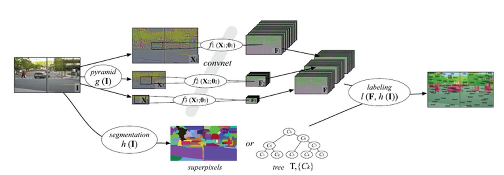
> 图3.3 有监督多尺度深度卷积分类网络结构示意图

FCN（Fully Convolutional Networks for Semantic Segmentation）[15]在其上做了很大的改动，被誉为深度学习在图像分割领域的开山之作。针对图像分割问题设计了一种针对任意大小输入的图像都可进行分割处理的端到端券卷积网络框架，如图3.4所示。FVN逐像素进行分类，同时为了克服CNN网络最后输出层缺少空间位置信息的不足，通过双线性插值和上采样将中间层输出的特征图进行由粗糙（coarse）到稠密（dense）的分割结果优化。

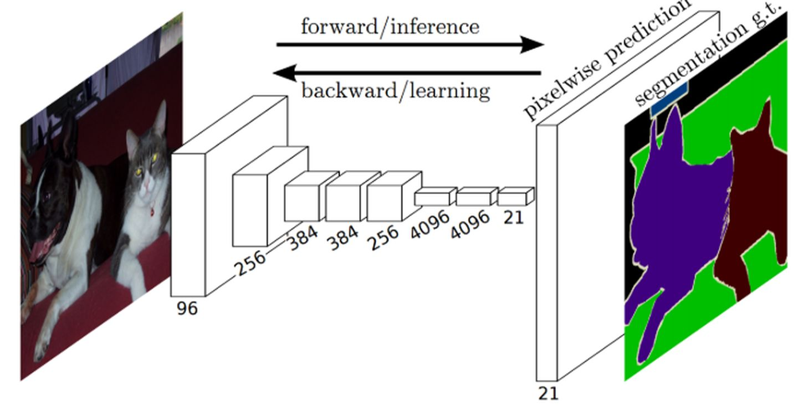
> 图3.4 FCN 网络结构示意图

DeepLab系列\[16][17]在FCN框架末端增加全连接的多个CRF，使得分割结果更精确，该网络采用了Dilated/Atrous Convolution的方式扩展感受野，获取更多的上下文信息，同时避免了DCNN中重复最大池化和下采样带来的分辨率下降问题，分辨率的下降会丢失细节，网络结构如图3.5所示。SegNet[18]参考FCN的思路，在编码器的池化和解码器的上采样中使用不同策略，通过一系列操作，使得总体计算效率较FCN略高。图3.6分别展示了SegNet的网络架构以及池化和反池化的操作。

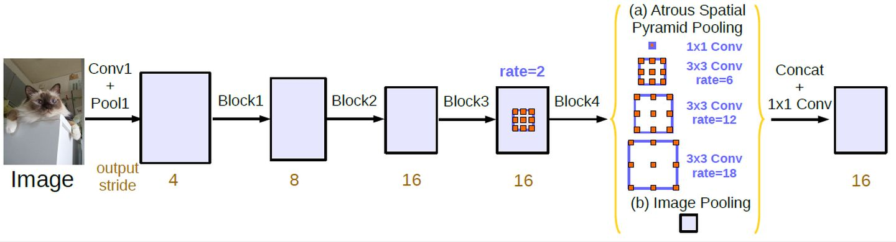
> 图3.5 DeepLab 网络结构示意图

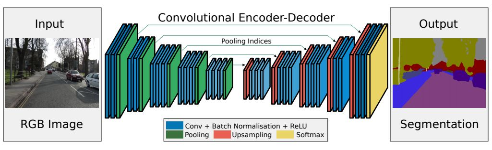
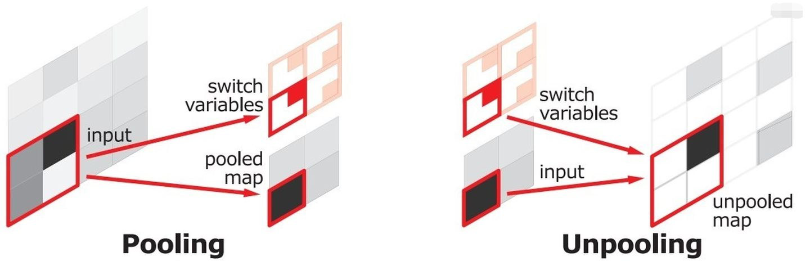
> 图3.6 SegNet 网络结构示意图(上);SegNet 中 pooling 和 unpooling 策略(下)

### 3.2 PaddleSeg简介

PaddleSeg[19]是基于飞桨PaddlePaddle开发的端到端图像分割开发套件，涵盖了高精度和轻量级等不同方向的大量高质量分割模型。通过模块化的设计，提供了配置化驱动和API调用两种应用方式，帮助开发者更便捷地完成从训练到部署的全流程图像分割应用。

有如下三个特性：

 （1）高精度模型：基于百度自研的半监督标签知识蒸馏方案（SSLD）训练得到高精度骨干网络，结合前沿的分割技术，提供了50+的高质量预训练模型，效果优于其他开源实现。

 （2）模块化设计：支持20+主流 分割网络 ，结合模块化设计的 数据增强策略 、骨干网络、损失函数等不同组件，开发者可以基于实际应用场景出发，组装多样化的训练配置，满足不同性能和精度的要求。

（3） 高性能：支持多进程异步I/O、多卡并行训练、评估等加速策略，结合飞桨核心框架的显存优化功能，可大幅度减少分割模型的训练开销，让开发者更低成本、更高效地完成图像分割训练。

PaddleSeg中的主流模型如表3.1所示

> 表3.1

PaddleSeg涵盖的模块和功能如图3.7所示。


> 图3.7 PaddleSeg 涵盖的模块和功能

PaddleSeg中有两大特性，在进行本综合课程设计中进行了广泛而充足的使用，分别是数据增强和模块化结构。

**A. 丰富的数据增强**

图像分割业务在真实场景下由于数据集标注成本高导致已标注数据少，同时线上应用场景繁杂。如果能将已标注的数据进行数据集的扩充，可以使数据集体量大大增加，同时不用增加人力成本。在PaddleSeg中提供了大量的数据增强实践用于进行数据集扩充，包括但不限于范围缩放（Range-Scaling）、模糊、旋转、加任意长宽比、颜色空间扰动、上下翻转、左右翻转。PaddleSeg进行数据增强的效果如图3.8所示。

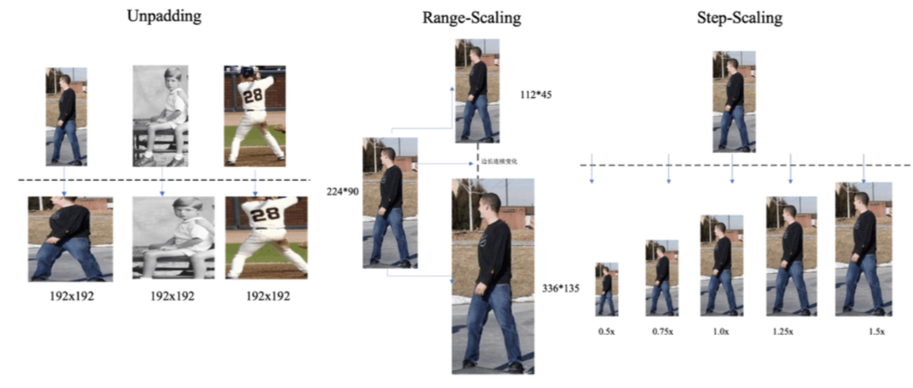
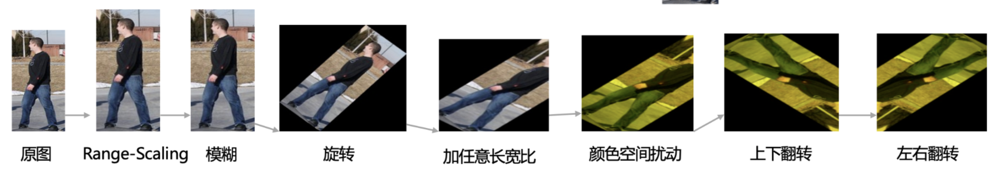
> 图3.8 PaddleSeg 进行数据增强的效果展示图

**B. 模块化设计**

PaddleSeg支持其中主流分割网络，可以搭载预训练模型和可调节的骨干网络满足不同性能和精度的要求，同时可以选择不同的损失函数强化小目标和不均衡样本场景下的分割精度。其模块坏的设计如图3.9所示。

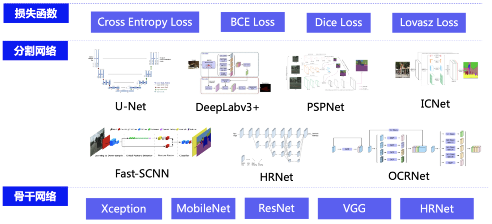
> 图3.9 PaddleSeg 的模块化设计示意图

### 3.3 车道线检测Baseline简介

本次综合课程设计，在线上资格赛中，飞桨官方提供了基线模型（Baseline）可以更加方便的进行上手。主要包含数据集准备与处理、执行训练、执行预测和提交结果四个部分。详细的使用与配置过程将在第四章研究工作中详细介绍。

训练参数主要如表3.2所示：

> 表3.2

配置项主要如表3.3所示：

> 表3.3 

## 4 主要研究工作

### 4.1 Baseline环境搭建

**A. 创建项目**

（1）在飞桨官网最上方点击 项目 - 创建项目

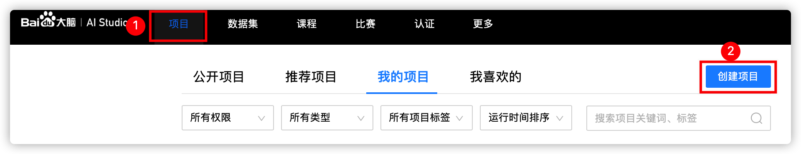
>  图4.1 在飞桨官网创建项目

（2）按图4.2所示创建项目

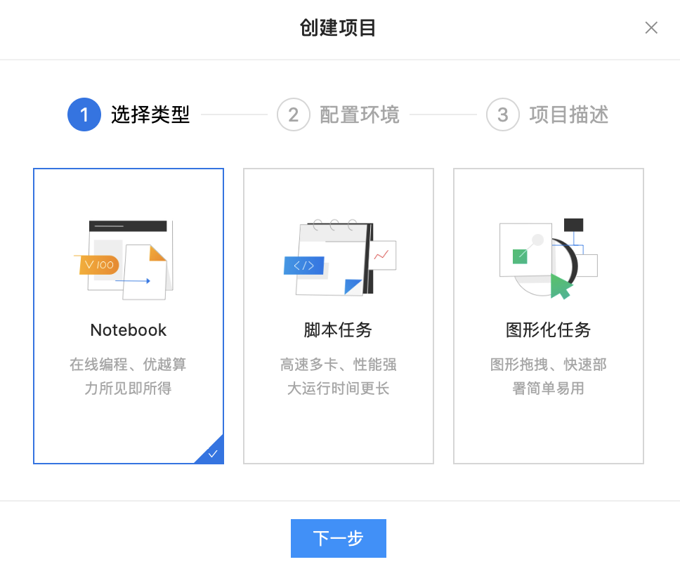
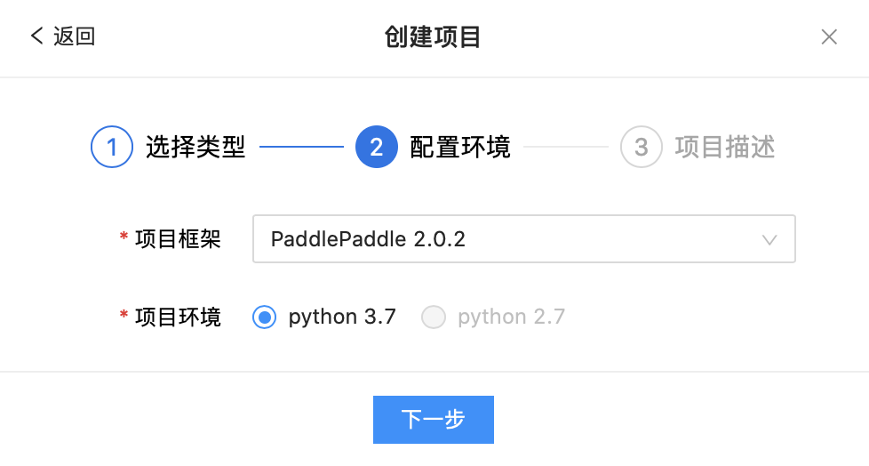
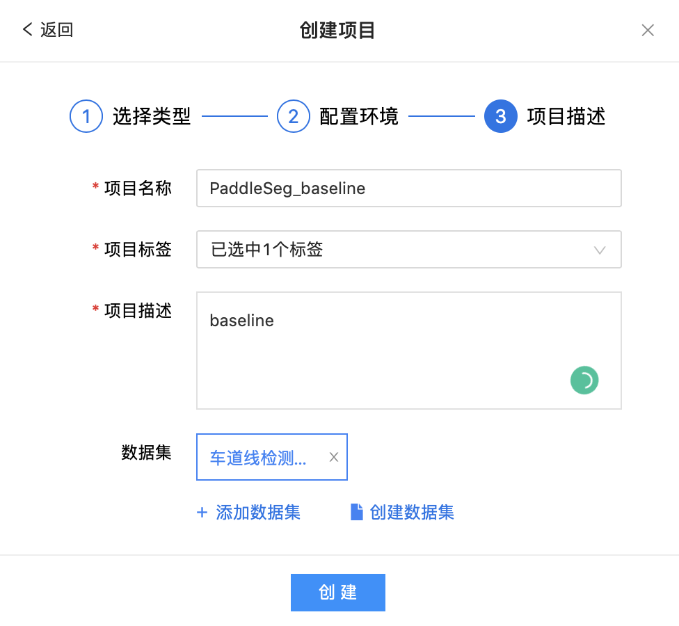
> 图4.2 创建项目步骤。(a): 选择创建项目类型；(b): 选择创建项目配置环境；(c):填写创建项目描述。

（3）在第三步选择 “添加数据集”，然后搜索“车道线检测Baseline资源包”并添加

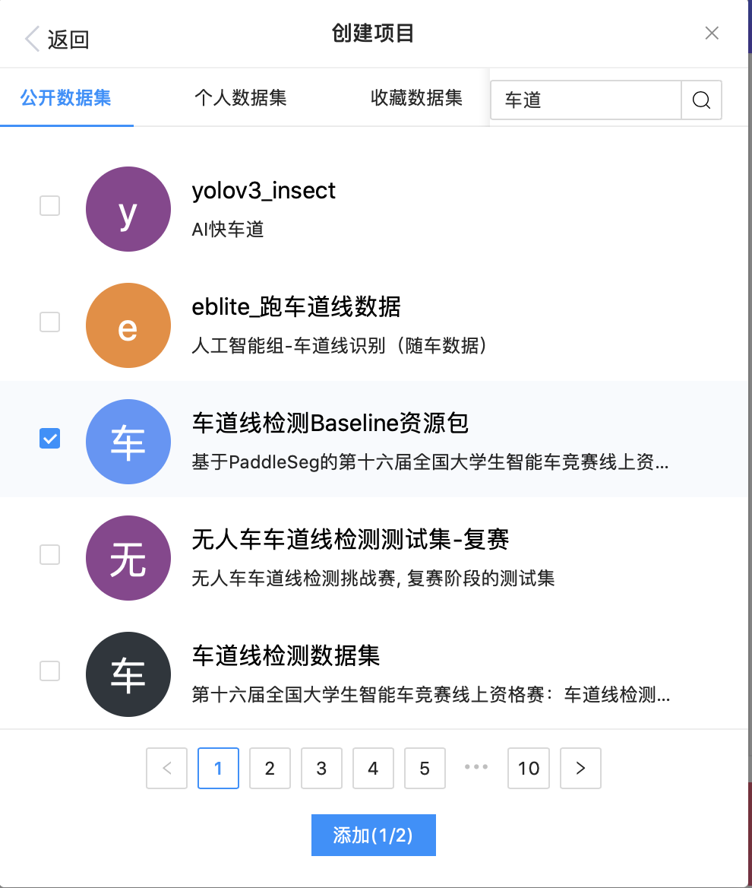
> 图4.3 为创建的项目选择车道线检测Baseline资源包

（4）在我的项目中选择“启动环境”，并选择带有GPU的高级版本

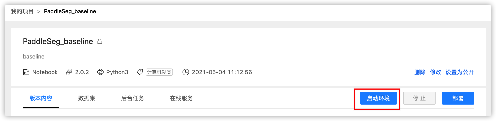
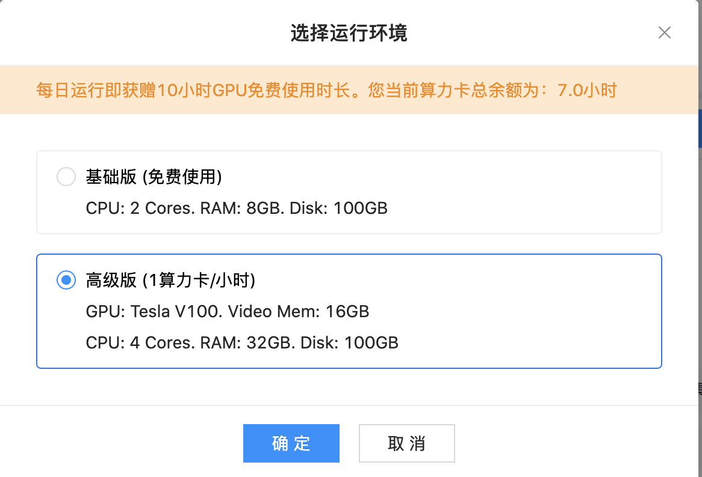
> 图4.4 启动所建项目环境。(a):启动环境；(b):选择带有GPU的高级版本 。

**B. 配置Baseline环境**

（1）数据准备

如果创建项目时数据集链接正确，则运行环境完全加载完毕后，数据集位于`/home/aistudio/data/data68698/智能车数据集.zip`，可以解压到如下两个文件夹中：

`data/`：用于本次使用（会在每次进入环境时重置，但可以节省项目启动时间）；`work/`：会持久化保存（但是加载环境速度慢）。

接着使用如下解压命令对数据集进行解压：
```jupyter
!unzip -oq /home/aistudio/data/data68698/智能车数据集.zip -d /home/aistudio/data
```

使用如下脚本指令进行数据集划分：
```jupyter
!python data/make_list.py
```
如果报路径相关错误，则可以直接使用终端输入指令进行实验，数据文件夹最终结构为

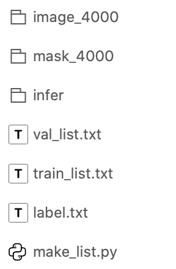
> 图4.5 配置好的Baseline文件目录结构

`image`和`mask`是用来train的数据集；`infer`是最终用于predict提交结果的数据集。

（2）训练

首先clone官方仓库并安装环境：

```jupyter
!git clone https://gitee.com/doubleZ0108/PaddleSeg.git
```
安装到`external-libraries`并引用可以做到持久化安装
```jupyter
!mkdir /home/aistudio/external-libraries
!pip install paddleseg -t /home/aistudio/external-libraries
import sys 
sys.path.append('/home/aistudio/external-libraries')
```

使用如下命令设置环境变量：
```jupyter
%set_env CUDA_VISIBLE_DEVICES=0
%set_env PYTHONPATH='/home/aistudio/PaddleSeg'
%cd /home/aistudio
```

修改（重写）yml文件，注意要更换`train_dataset`中的`dataset_root` `train_path`和`val_dataset`中的`dataset_root` `train_path`。

使用如下命令执行训练：
```jupyter
%cd PaddleSeg/
!python train.py \
       --config configs/mytest/mytest_model.yml \
       --do_eval \
       --use_vdl \
       --save_interval 1000 \
       --save_dir output \
```
其中的`save_interval`为多少轮训练之后保存结果。重新训练时可以增加`--resume_model output/iter_4000`从上次的训练继续执行。

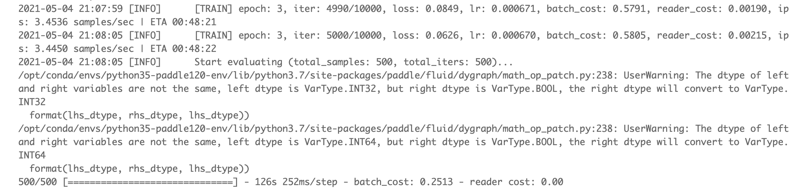
> 图4.6 执行训练时的截图

（3）预测

使用如下命令进行预测：

```jupyter
%cd PaddleSeg/
!python predict.py \
       --config configs/mytest/mytest_model.yml \
       --model_path output/iter_1000/model.pdparams \
       --image_path ../work/infer \
       --save_dir output/result
```
`config`：配置的`yml`文件；`model_path`：训练后的模型；`image_path`：官方数据集文件夹中的`infer`目录；`save_dir`：预测结果保存的位置。

**C. 提交结果**

将结果打包成`predict.zip`并下载
```jupyter
%cd PaddleSeg/output/result/pseudo_color_prediction
!zip -r -o /home/aistudio/predict.zip ./
```

然后提交到官网（注意压缩包文件名必须为`predict`）

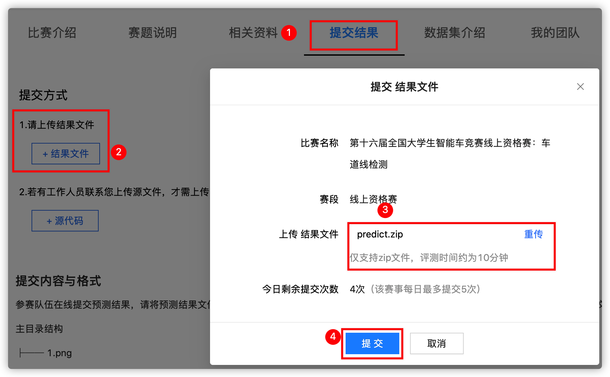
> 图4.7 将结果提交到官网步骤截图

### 4.2 数据处理

#### 4.2.1 数据扩充

除了在3.2节介绍的PaddleSeg在数据增强上的功能外，我还进行了大量数据集方面的尝试，最主要进行数据集的扩充。现有的数据集数据集如在第五章介绍仿真结果时所讲述的只有5000张数据，对于大型复杂计算机视觉问题来说仍然较少。

本节主要参考笔者2020年暑期在浙江大学IDEA Lab实习时针对玩具进行目标识别算法开发任务整理和实践的数据集扩充方法。

但也要注意，在训练图像识别的深度神经网络时，使用大量更多的训练数据，可以使网络得到更好的性能，例如提高网络的分类准确率，防止过拟合等。但人为扩展训练数据时对数据的操作最好能反映真实世界的变化。人为扩充数据集之后如果分类准确率有明显的提升，说明我们对数据所做的拓展操作是良性的，能够“反映真实世界的变化”，就会被用到整个数据集的扩展。反之，则说明不能用此操作对数据集进行拓展。

笔者使用五大方面共计11种方法对车道线数据集进行扩充，将训练数据集中一张图像扩充后的结果如图4.8所示。接下来将依次简单介绍每种方法。

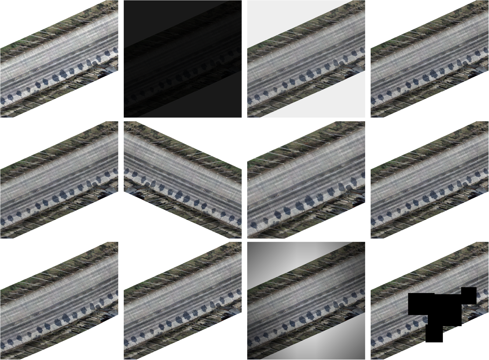
> 图4.8 笔者进行数据扩充的效果展示图。按从左到右从上到下的顺序依次为:亮度变化(lightness, darkness)、对比度变化(contrast)、锐化(sharpen)、高斯模糊(blur)、镜像反转(flip)、图像裁剪(crop)、图像拉 伸(deform)、镜头畸变(distortion)、椒盐噪声(noise)、渐晕(vignetting)、随机抠除(cutout)

**A.图像强度变换** 

（1）亮度变化：图像整体加上一个随机偏差，或整体进行尺度的放缩。记为lightness和darkness。

```python
brightness = 1 + np.random.randint(1, 9) / 10
brightness_img = img.point(lambda p: p * brightness)
```

（2）对比度变化：扩展图像灰度级动态范围，对两极的像素进行压缩，对中间范围的像素进行扩展。记为contrast。

```python
range_contrast=(-50, 50)
contrast = np.random.randint(*range_contrast)
contrast_img = img.point(lambda p: p * (contrast / 127 + 1) - contrast)
```

**B. 图像滤波**

（1）锐化：增强图像边缘信息。记为sharpen。

```python
identity = np.array([[0, 0, 0],
                     [0, 1, 0],
                     [0, 0, 0]])
sharpen = np.array([[ 0, -1,  0],
                    [-1,  4, -1],
                    [ 0, -1,  0]]) / 4
max_center = 4
sharp = sharpen * np.random.random() * max_center
kernel = identity + sharp
sharpen_img = cv2.filter2D(img, -1, kernel)
```

（2）高斯模糊：图像平滑。记为blur。

```python
kernel_size = (7, 7)
blur_img = cv2.GaussianBlur(img,kernel_size,0)
```

**C. 透视变换**

（1）镜像翻转：使图像沿长轴进行翻转。记为flip。

```python
flip_img = cv2.flip(cv2.cvtColor(np.asarray(img),cv2.COLOR_RGB2BGR), 1)
```

（2）图像裁剪：裁剪原图80%大小的中心图像，并进行随机移动。记为crop。

```python
kernel_size = list(map(lambda x: int(x*0.8), size))
shift_min, shift_max = -50, 50
shift_size = [np.random.randint(shift_min, shift_max), np.random.randint(shift_min, shift_max)]

crop_img = img[
  (size[0]-kernel_size[0])//2+shift_size[0]:(size[0]-kernel_size[0])//2+kernel_size[0]+shift_size[0],
  (size[1]-kernel_size[1])//2+shift_size[1]:(size[1]-kernel_size[1])//2+kernel_size[1]+shift_size[1]
]
```

（3）图像拉伸：拉伸成长宽为原始宽的正方形图像。记为deform。

```python
deform_img = img.resize((int(w), int(w)))
```

（4）镜头畸变：对图像进行透视变化，模拟鱼眼镜头的镜头畸变，通过播放径向系数k1，k2，k3和切向系数$\rho1$, $\rho2$实现。记为distortion。

```python
d_coef= np.array((0.15, 0.15, 0.1, 0.1, 0.05))
# get the height and the width of the image
h, w = img.shape[:2]
# compute its diagonal
f = (h ** 2 + w ** 2) ** 0.5
# set the image projective to carrtesian dimension
K = np.array([[f, 0, w / 2],
              [0, f, h / 2],
              [0, 0,   1  ]])
d_coef = d_coef * np.random.random(5) # value
d_coef = d_coef * (2 * (np.random.random(5) < 0.5) - 1) # sign
# Generate new camera matrix from parameters
M, _ = cv2.getOptimalNewCameraMatrix(K, d_coef, (w, h), 0)
# Generate look-up tables for remapping the camera image
remap = cv2.initUndistortRectifyMap(K, d_coef, None, M, (w, h), 5)
# Remap the original image to a new image
distortion_img = cv2.remap(img, *remap, cv2.INTER_LINEAR)
```

**D. 注入噪声**

（1）椒盐噪声：在图像中随机添加白/黑像素。记为noise。

```python
for i in range(5000):
  x = np.random.randint(0,rows)
  y = np.random.randint(0,cols)
  noise_img[x,y,:] = 255
  noise_img.flags.writeable = True
```

（2）渐晕：对图像添加一个圆范围内的噪声模拟光晕。记为vignetting。

```python
ratio_min_dist=0.2
range_vignette=np.array((0.2, 0.8))
random_sign=False

h, w = img.shape[:2]
min_dist = np.array([h, w]) / 2 * np.random.random() * ratio_min_dist

# create matrix of distance from the center on the two axis
x, y = np.meshgrid(np.linspace(-w/2, w/2, w), np.linspace(-h/2, h/2, h))
x, y = np.abs(x), np.abs(y)
# create the vignette mask on the two axis
x = (x - min_dist[0]) / (np.max(x) - min_dist[0])
x = np.clip(x, 0, 1)
y = (y - min_dist[1]) / (np.max(y) - min_dist[1])
y = np.clip(y, 0, 1)
# then get a random intensity of the vignette
vignette = (x + y) / 2 * np.random.uniform(*range_vignette)
vignette = np.tile(vignette[..., None], [1, 1, 3])
sign = 2 * (np.random.random() < 0.5) * (random_sign) - 1
vignetting_img = img * (1 + sign * vignette)
```

**E. 其他：随机抠除**：随机抠出四个位置，并用黑色/彩色矩形填充。记为cutout。

```python
channel_wise = False
max_crop = 4
replacement=0

size = np.array(img.shape[:2])
mini, maxi = min_size_ratio * size, max_size_ratio * size
cutout_img = img
for _ in range(max_crop):
  # random size
  h = np.random.randint(mini[0], maxi[0])
  w = np.random.randint(mini[1], maxi[1])
  # random place
  shift_h = np.random.randint(0, size[0] - h)
  shift_w = np.random.randint(0, size[1] - w)

  if channel_wise:
    c = np.random.randint(0, img.shape[-1])
    cutout_img[shift_h:shift_h+h, shift_w:shift_w+w, c] = replacement
    else:
      cutout_img[shift_h:shift_h+h, shift_w:shift_w+w] = replacement
```

需要说明的是，crop、deform、distortion由于对图像尺度或图像像素分布进行变化，因此标注数据受到影响，无法通过算法恢复，在有监督深度学习进行数据集扩充时一般不采用这三类方法。

#### 4.2.2 数据均衡

笔者通过对数据集进行统计，发现官方提供的智能车数据集中Label 2和Label 6种类尤其多，而一些其他的Label非常少。在有监督学习中这样的数据集组成不利于整体模型的优化，也对最终使用模型进行预测不利。

进行数据集统计的代码如下：

```python
mask_pt = '/home/aistudio/work/mask_4000'
count =  [0 for _ in range(16)]
for m in tqdm(os.listdir(mask_pt)):
    pt = os.path.join(mask_pt, m)
    mask = cv2.imread(pt, 0)
    size = mask.shape[0] * mask.shape[1]
    for i in range(16):
        a = mask == i
        ratio_i = np.sum(a.astype(np.float)) / size
        count[i] += ratio_i
sum_ = np.sum(count[1:])
ratios = [v/sum_ for v in count[1:]]
for i in range(0, len(ratios)):
    print('-[INFO] Label {}: {:.4f}'.format(i+1, ratios[i]))
```

统计结果通过matplotlib库进行可视化，如图4.9所示：

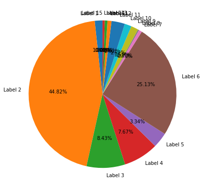
> 图4.9 原始数据集中的 Label 分布示意图

接着笔者对数据集进行均衡化处理，核心代码如下：

```python
count =  [0 for _ in range(16)]
mask_pt = '/home/aistudio/work/mask_4000'
for m in tqdm(os.listdir(mask_pt)):
    pt = os.path.join(mask_pt, m)
    mask = cv2.imread(pt, 0)
    size = mask.shape[0] * mask.shape[1]
    for i in range(16):
        a = mask == i
        ratio_i = np.sum(a.astype(np.float)) / size
        count[i] += ratio_i
mask_pt = '/home/aistudio/aug_data/mask_4000'
for m in tqdm(os.listdir(mask_pt)):
    pt = os.path.join(mask_pt, m)
    mask = cv2.imread(pt, 0)
    size = mask.shape[0] * mask.shape[1]
    for i in range(16):
        a = mask == i
        ratio_i = np.sum(a.astype(np.float)) / size
        count[i] += ratio_i
sum_ = np.sum(count[1:])
ratios = [v/sum_ for v in count[1:]]
```

再次使用matplotlib库进行可视化，如图4.10所示：

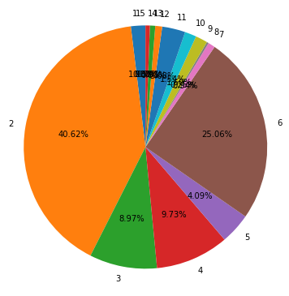
> 图4.10 均衡化后数据集中的 Label 分布示意图

经过数据均衡后在实际实验中证明确对模型结果有不小的提升，但也要注意的是，绝对的均衡是不存在的。

### 4.3 模型融合

笔者在车道线检测项目中除了常规的调参和不同模型的更换尝试外，还进行了模型融合的尝试以更大程度发挥不同模型的效能并使得最终的神经网络鲁棒。

在深度学习中，模型融合是有效提升精度的手段，尤其在单模型精度有限的情况下，让两个模型同时判断一幅图片可信度更高。笔者融合HRNet_W48与Ocrnet模型，进行基于HRNet_W48的Ocrnet模型尝试。

最终用于预测时模型的config为：

（1）config1: ocrnet/ocrnet_hrnetw18_cityscapes_1024x512_160k.yml

（2）config2: ocrnet/ocrnet_hrnetw48_cityscapes_1024x512_160k.yml

用于预测时模型的model为：

（1）model1: data78054/model.pdparams

（2）model2: data78048/hr48_3572_37525.pdparams

两模型融合后的损失函数如公式4.x所示，在实现中取$\alpha=0.5, \beta=0.5$。
$$
L_{final} = \sum \alpha L_{Ocrnet} + \beta L_{HRNet\_W48}
$$
两模型的参数配置如下：

```yml
optimizer:
  type: sgd

learning_rate:
  value: 0.002
  decay:
    type: poly
    power: 0.9
    end_lr: 0.0

loss:
  types:
    - type: LovaszSoftmaxLoss
    - type: LovaszSoftmaxLoss
  coef: [1,0.4]
```


在输出结果时笔者还进行了中值滤波让结果更加平滑，提高准确度，核心代码如下：

```python
for im in os.listdir(base):
    pt = os.path.join(base, im)
    img = cv2.imread(pt, 0)
    img = cv2.medianBlur(img, 5)
    cv2.imwrite(img, pt)
```


## 5 仿真结果

### 5.1 数据集

本次赛题数据集包括5000张高精度俯视图数据，并对这些图片数据标注了车道线的区域和类别，其中标注数据以灰度图的方式存储。 标注数据是与原图尺寸相同的单通道灰度图，其中背景像素的灰度值为0，不同类别的车道线像素分别为不同的灰度值，具体如图5.1所示。

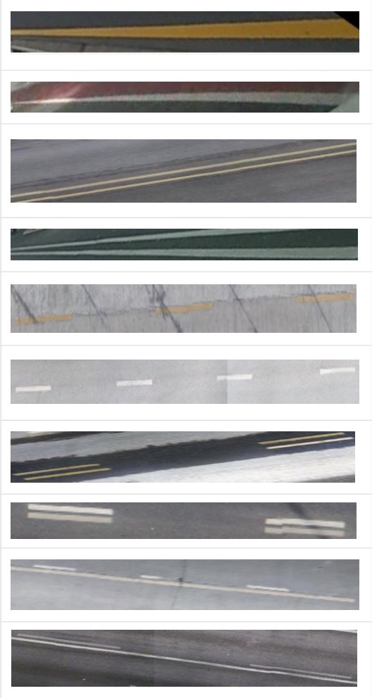
> 图5.1 从上到下灰度值从1到10，分别为：黄色单实线、白色单实线、黄色双实线（一白一黄）、白色双实线、黄色单虚线、白色单虚线、黄色双虚线（一白一黄）、白色双虚线、黄色一虚一实线（一白一黄）和白色一虚一实线

需注意的是，灰度值较低仅影响肉眼可见性，并不影响深度学习训练。如需要观测标注图像，可以将其拉伸至0~255的RGB图像，图5.2展示了这种情况。

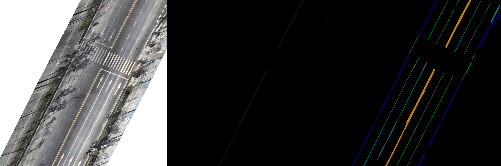
> 图5.2 从左到右：原始图像，标注图像，彩色化的标注图像


### 5.2 性能指标

与通常的图像分割任务一样，车道线挑战赛使用mIoU来评估结果。对于每一类，利用预测图像和真值图像，mIoU 可以计算如公式5.1所示：
$$
\begin{aligned}
\mathrm{mIoU} &=\frac{1}{C} \sum_{c=1}^{C} \mathrm{IoU}_{c} \\
\mathrm{IoU}_{c} &=\frac{\mathrm{TP}}{\mathrm{TP}+\mathrm{FP}+\mathrm{FN}} \\
\end{aligned}
$$
其中，$C$是分类数，在本任务中是车道线的类别数，$TP$，$FP$ ，$TN$和$TP$分别表示true positive，false positive，false negative和true positive，其对应公式分别如公式5.2，5.3和5.4所示。
$$
\mathrm{TP} =\sum_{i}\left\|M_{c i} \cdot M_{c i}^{*}\right\|_{0}
$$

$$
\mathrm{FP}=\sum_{i}\left\|M_{c i} \cdot\left(1-M_{c i}^{*}\right)\right\|_{0}
$$

$$
\mathrm{FN}=\sum_{i}\left\|\left(1-M_{c i}\right) \cdot M_{c i}^{*}\right\|_{0}
$$

参考其他数据集和任务的性能指标表示，mIoU推导公式如5.5所示。
$$
\begin{aligned}
m I o U &=\frac{1}{k+1} \sum_{i=0}^{k} \frac{p_{i i}}{\sum_{j=0}^{k} p_{i j}+\sum_{j=0}^{k} p_{j i}-p_{i i}} \\
m I o U &=\frac{1}{k+1} \sum_{i=0}^{k} \frac{T P}{F N+F P+T P}
\end{aligned}
$$

除在比赛中用到的性能评价指标外，还经常使用准确率、召回率、Kappa系数等进行模型结果的评价。


### 5.3 仿真展示

图5.3展示了笔者所用的方法在本次车道线挑战赛中部分预测数据集上的表现效果。从图中可以看到对不同种类的车道线预测以及不同情况下的处理已经很不错，欠缺在车道线有遮挡的位置仍是较难通过学习的方法进行推演补全整条车道线。

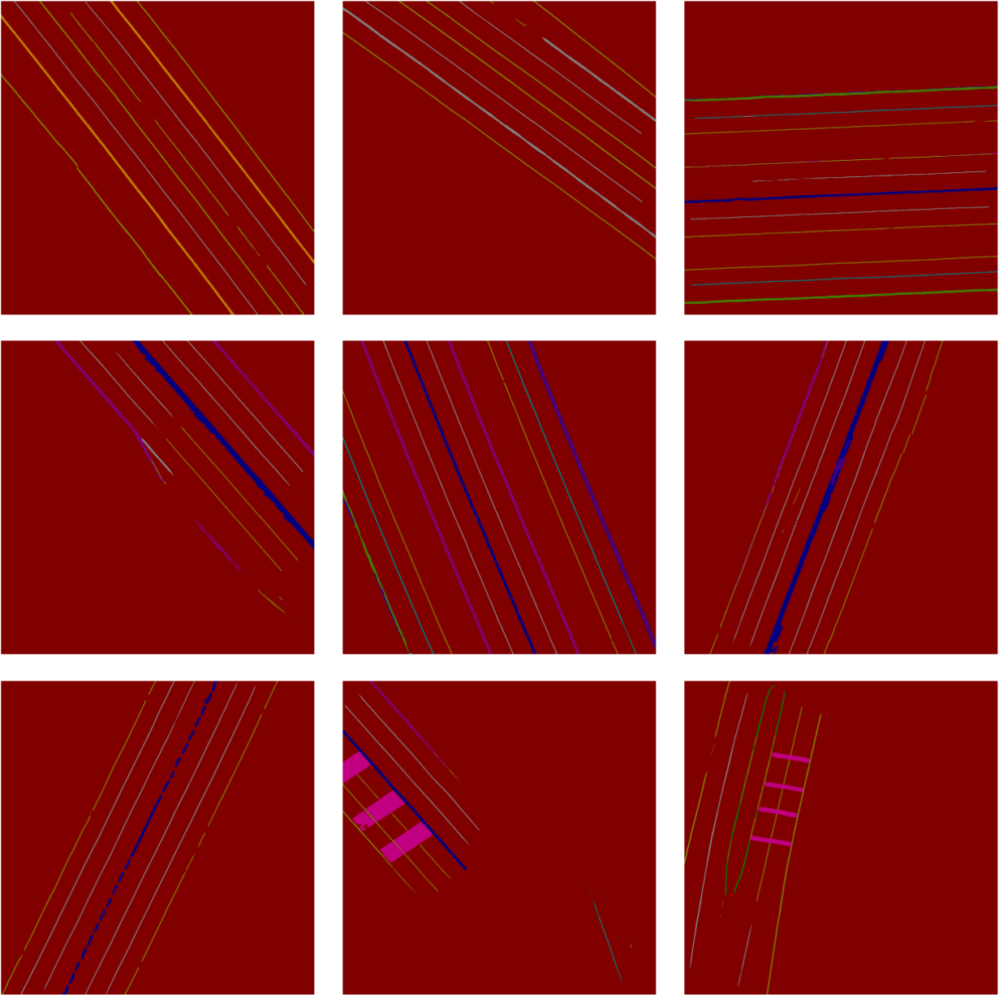
> 图5.3 预测数据集上部分图片的表现效果


## 6 结果和讨论

经过长达接近三个月的努力，笔者在本次比赛中最高score获得0.37664分，在该比赛截止时，排名73位。详细的信息如图6.1所示。

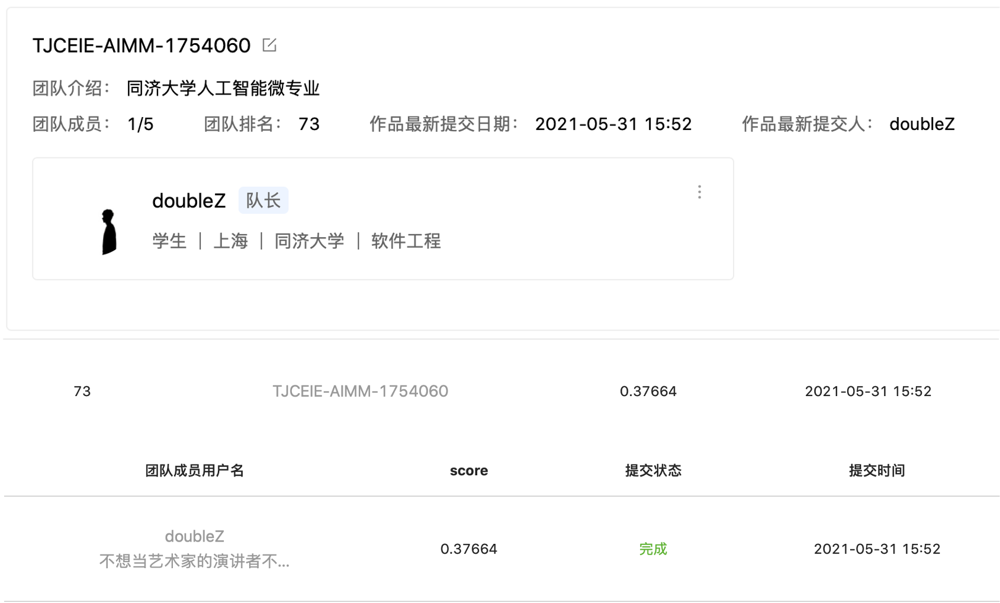
> 图6.1 笔者的成绩和排名

通过第十六届全国大学生智能车竞赛线上资格赛——车道线检测的比赛，让我从零学会使用百度飞桨平台搭建自己的项目，并从零开始接触基于深度学习的图像分割问题，虽然最终的成绩没能达到更加理想的效果，也有很多细节方面不甚清楚，但站在时间轴的尽头回归整个过程，能更加深刻地让我感受到这一路的成长，同时也更加让我坚定最开始报名第一届学生辅修人工智能微专业。

非常感谢电子与信息工程学院控制科学与工程系人工智能教研室的老师们为我们量身选择了这场比赛；感谢人工智能微专业的各位指导老师对技术方面的指导；感谢百度飞桨团队的各位工程师提供这样出色的平台供我们训练和学习。通过本次比赛，通过亲自上手的实践、不断调优的尝试和不断探索发掘先进方法的调研，让我对基于深度学习的实战应用有了感性和理性的认识。

未来我将赴北京大学信息工程学院继续攻读研究生，研究方向同样为基于深度学习的计算机视觉问题，本次比赛和人工智能辅修虽然是我大学生活的句号，却是我未来路上的开始。“夫吴人与越人相恶也，当其同舟共济，遇风，其相救也，如左右手”。这句写在录取通知书上的话我会终生铭记，感谢四年里同济对我的培养。追求卓越的路上永远没有尽头，同济，不说再见。


## 7 参考文献

```
[1]Oliveira G L, Burgard W, Brox T. Efficient deep models for monocular road segmentation[C]//2016 IEEE/RSJ International Conference on Intelligent Robots and Systems (IROS). IEEE, 2016: 4885-4891.
[2]Chen Z, Chen Z. Rbnet: A deep neural network for unified road and road boundary detection[C]//International Conference on Neural Information Processing. Springer, Cham, 2017: 677-687.
[3]Pan X, Shi J, Luo P, et al. Spatial as deep: Spatial cnn for traffic scene understanding[C]//Proceedings of the AAAI Conference on Artificial Intelligence. 2018, 32(1).
[4]Neven D, De Brabandere B, Georgoulis S, et al. Towards end-to-end lane detection: an instance segmentation approach[C]//2018 IEEE intelligent vehicles symposium (IV). IEEE, 2018: 286-291.
[5]Bai M, Mattyus G, Homayounfar N, et al. Deep multi-sensor lane detection[C]//2018 IEEE/RSJ International Conference on Intelligent Robots and Systems (IROS). IEEE, 2018: 3102-3109.
[6]Garnett N, Cohen R, Pe'er T, et al. 3D-LaneNet: end-to-end 3D multiple lane detection[C]//Proceedings of the IEEE/CVF International Conference on Computer Vision. 2019: 2921-2930.
[7]Guo Y, Chen G, Zhao P, et al. Gen-LaneNet: A Generalized and Scalable Approach for 3D Lane Detection[J]. arXiv e-prints, 2020: arXiv: 2003.10656.
[8]Greig D M, Porteous B T, Seheult A H. Exact maximum a posteriori estimation for binary images[J]. Journal of the Royal Statistical Society: Series B (Methodological), 1989, 51(2): 271-279.
[9]Shi J, Malik J. Normalized cuts and image segmentation[J]. IEEE Transactions on pattern analysis and machine intelligence, 2000, 22(8): 888-905.
[10]Boykov Y, Funka-Lea G. Graph cuts and efficient ND image segmentation[J]. International journal of computer vision, 2006, 70(2): 109-131.
[11]Rother C, Kolmogorov V, Blake A. " GrabCut" interactive foreground extraction using iterated graph cuts[J]. ACM transactions on graphics (TOG), 2004, 23(3): 309-314.
[12]Comaniciu D, Meer P. Mean shift: A robust approach toward feature space analysis[J]. IEEE Transactions on pattern analysis and machine intelligence, 2002, 24(5): 603-619.
[13]Achanta R, Shaji A, Smith K, et al. SLIC superpixels compared to state-of-the-art superpixel methods[J]. IEEE transactions on pattern analysis and machine intelligence, 2012, 34(11): 2274-2282.
[14]Farabet C, Couprie C, Najman L, et al. Learning hierarchical features for scene labeling[J]. IEEE transactions on pattern analysis and machine intelligence, 2012, 35(8): 1915-1929.
[15]Long J, Shelhamer E, Darrell T. Fully convolutional networks for semantic segmentation[C]//Proceedings of the IEEE conference on computer vision and pattern recognition. 2015: 3431-3440.
[16]Krähenbühl P, Koltun V. Efficient inference in fully connected crfs with gaussian edge potentials[J]. Advances in neural information processing systems, 2011, 24: 109-117.
[17]Chen L C, Papandreou G, Kokkinos I, et al. Deeplab: Semantic image segmentation with deep convolutional nets, atrous convolution, and fully connected crfs[J]. IEEE transactions on pattern analysis and machine intelligence, 2017, 40(4): 834-848.
[18]Kendall A, Badrinarayanan V, Cipolla R. Bayesian segnet: Model uncertainty in deep convolutional encoder-decoder architectures for scene understanding[J]. arXiv preprint arXiv:1511.02680, 2015.
[19]Liu Y, Chu L, Chen G, et al. PaddleSeg: A High-Efficient Development Toolkit for Image Segmentation[J]. arXiv preprint arXiv:2101.06175, 2021.
```

